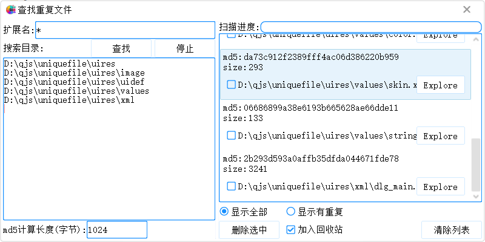

# 重复文件分析工具
##拖动文件夹到“搜索目录”窗口，点击“查找”来分析重复文件。文件分析时，计算开头和结尾各指定长度的md5(长度默认为1024字节，可以在界面上调节）,本程序重点演示在js中使用worker来实现多线程处理。
##本项目依赖soui4js项目，确保本项目和soui4js在同一个目录下。
##最后运行run.bat,会自动调用soui4js\Release\soui4js-host.exe来启动本播放器。

启程软件 2023-05-25